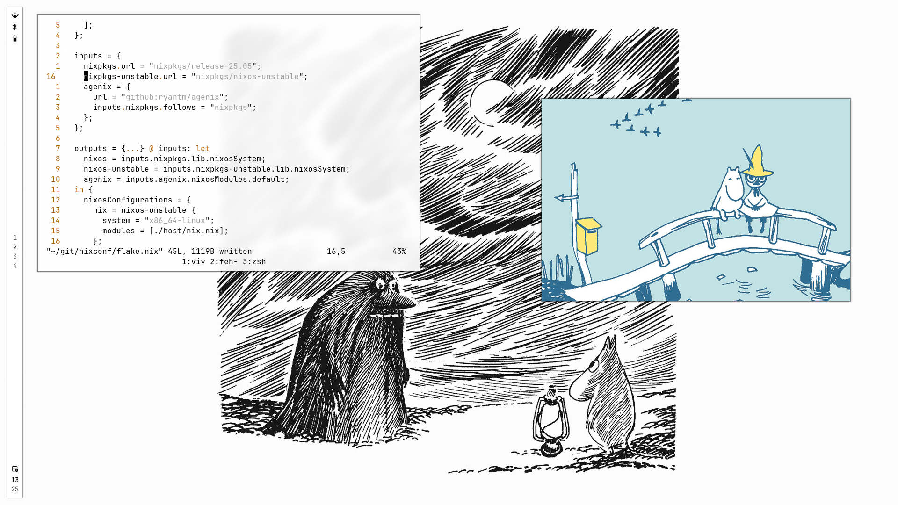
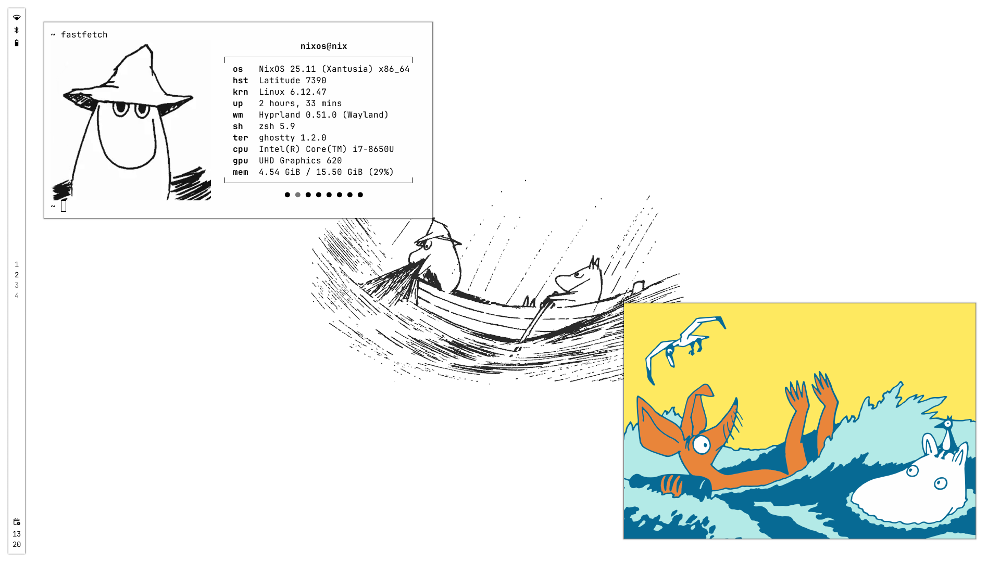
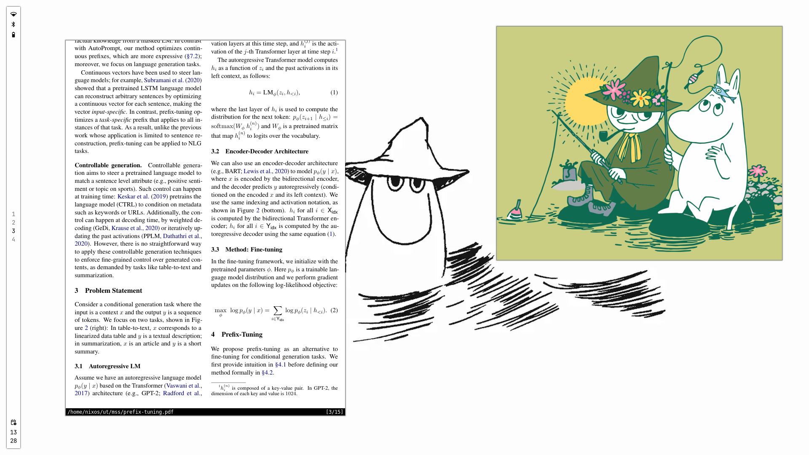
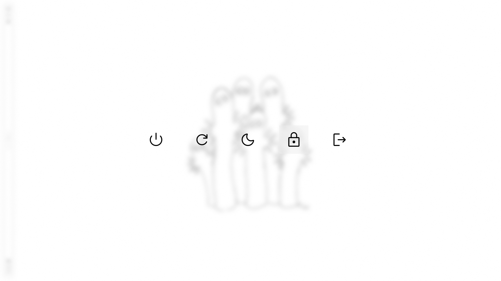
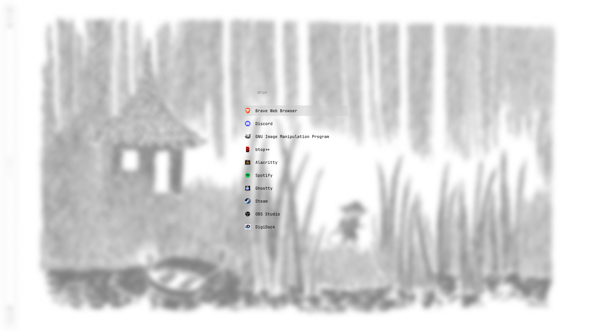
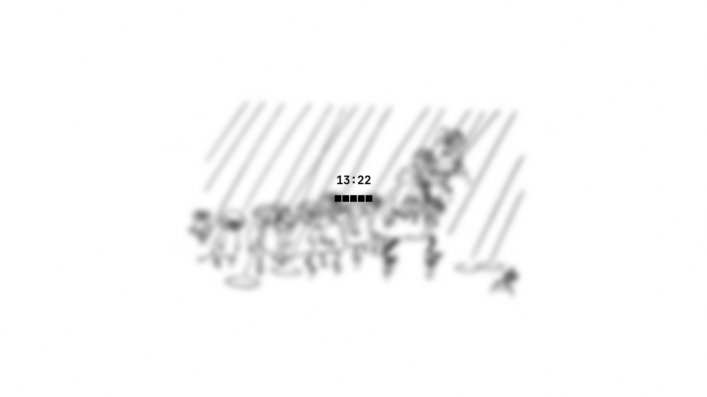

# Moomin

Moomin themed Linux rice!

|  |  |
| ------------------------------------------- | ---------------------------------------- |
|   |  |
|     |   |
|      |                                          |

## Dependencies

| program            | usage                |
| ------------------ | -------------------- |
| `hyprland`         | windowmanager        |
| `hyprlock`         | session locker       |
| `hypridle`         | idle daemon          |
| `alacritty`        | terminal             |
| `waybar`           | status bar           |
| `swww`             | wallpaper daemon     |
| `rofi`             | launcher             |
| `hellwal`          | coloschemes          |
| `fastfetch`        | system info          |
| `imagemagick`      | wallpaper thumbnails |
| `jetbrains-mono`   | font                 |
| `material-symbols` | icon font            |

## Install

> [!CAUTION]
> Backup your current configs beforehand

```bash
mkdir -p ~/.config
mkdir -p ~/.local/bin
mkdir -p ~/Pictures/walls

cp -r config/* ~/.config
cp script/* ~/.local/bin
cp assets/walls/* ~/Pictures/walls
```

Press `Mod+B` to run the wallpaper selector, it will take some time when starting for the first time.

