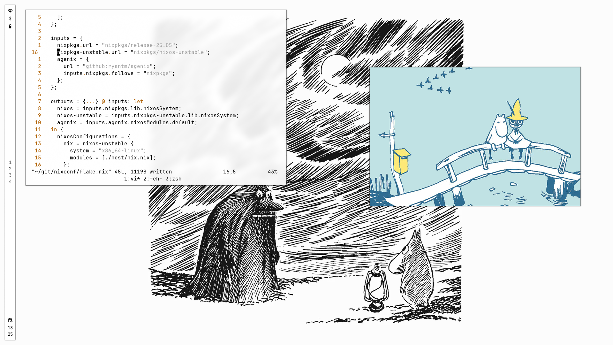
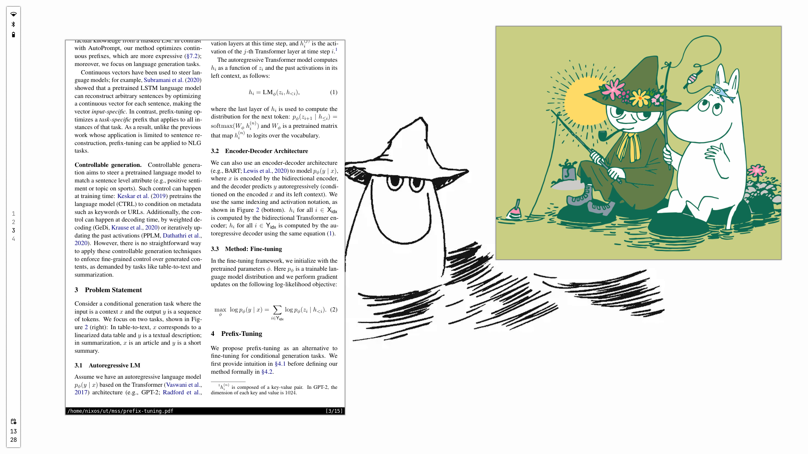
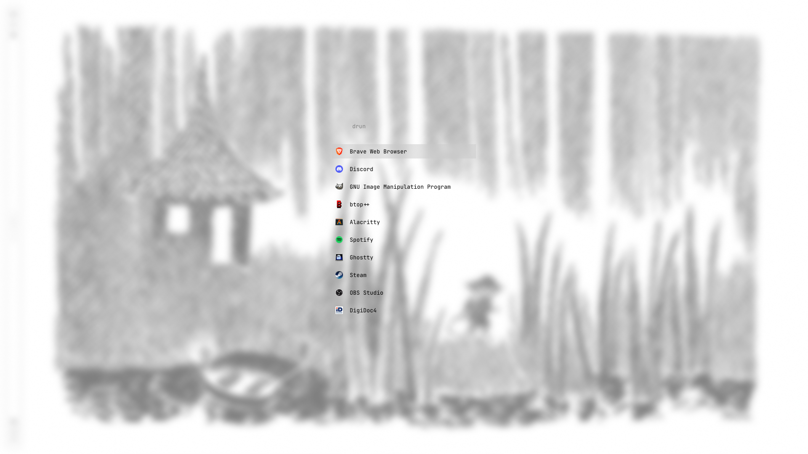

# Moomin

|  |  |
| -------------------------------------- | ------------------------------------- |
|     |     |

## Dependencies

| Package         | Purpose                                   |
| --------------- | ----------------------------------------- |
| `hyprland`      | Wayland compositor                        |
| `hypridle`      | Idle management daemon                    |
| `hyprlock`      | Screen locker                             |
| `waybar`        | Status bar                                |
| `dunst`         | Notification daemon                       |
| `rofi`          | Application launcher & wallpaper picker   |
| `alacritty`     | Terminal emulator                         |
| `fastfetch`     | System info                               |
| `matugen`       | Material You color theme generator        |
| `awww`          | Wallpaper setter with transitions         |
| `grim` `slurp`  | Screenshots (`grimblast`)                 |
| `wireplumber`   | Audio control (`wpctl`)                   |
| `brightnessctl` | Backlight control                         |
| `playerctl`     | Media player control                      |
| `wl-clipboard`  | Clipboard (`wl-copy`)                     |
| `wtype`         | Keyboard typing                           |
| `imagemagick`   | Thumbnail generation for wallpaper picker |

### Fonts

- [JetBrainsMono Nerd Font](https://www.nerdfonts.com/font-downloads)
- [Material Symbols Rounded](https://github.com/google/material-design-icons)

## Install

```bash
./install.sh
```
